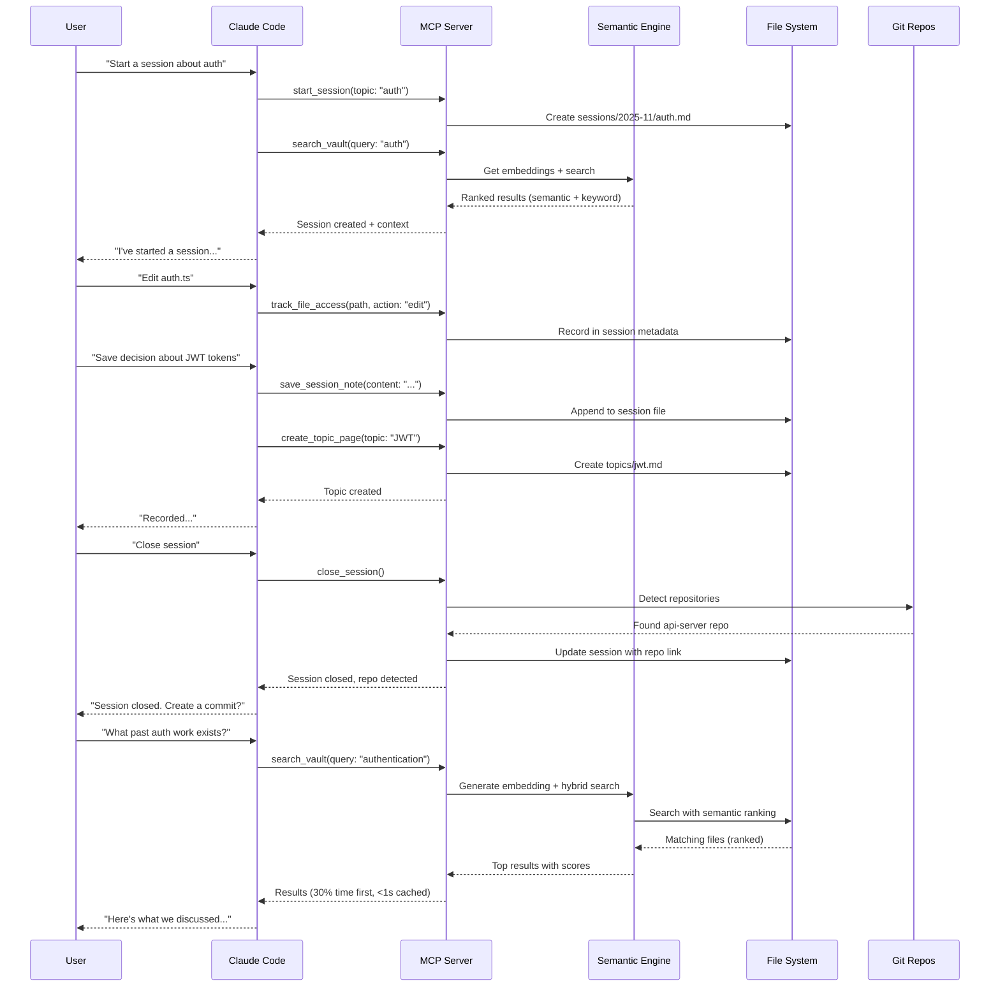
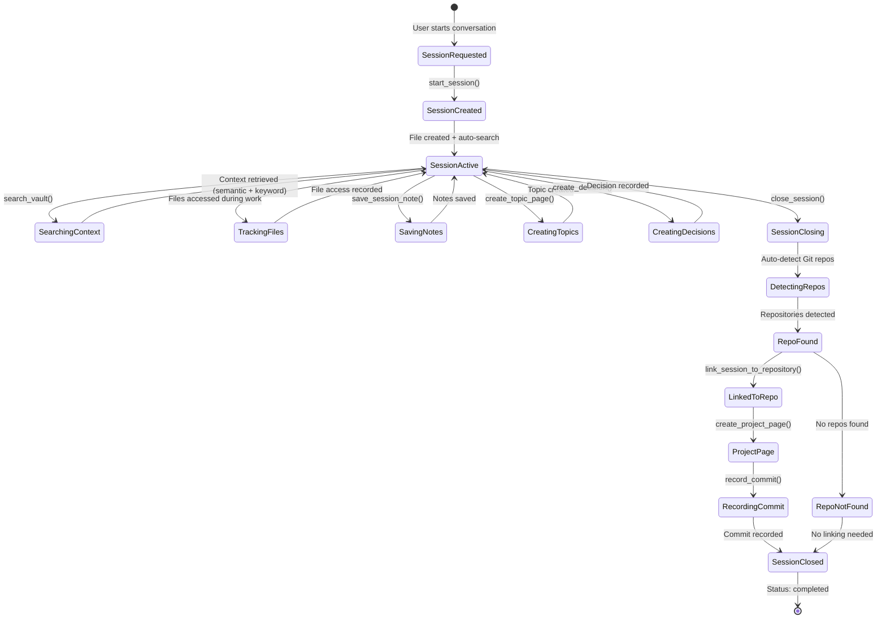
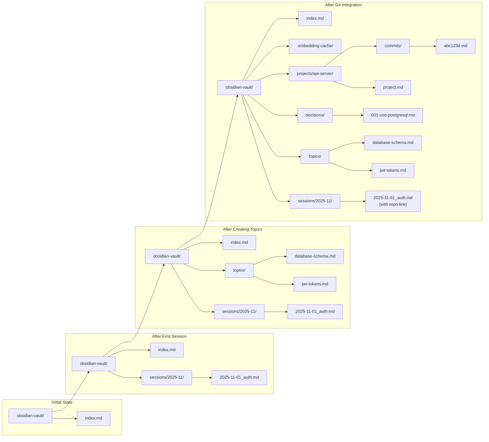
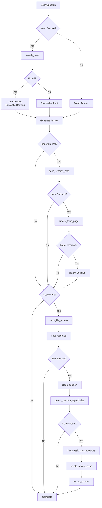

# Architecture Diagram

```mermaid
graph TB
    subgraph "User Environment"
        User[👤 User]
        CC[Claude Code]
        Obs[📓 Obsidian App]
    end

    subgraph "MCP Server Process"
        MCP[🔧 Obsidian MCP Server]

        subgraph "Session & Content Tools"
            T1[start_session]
            T2[save_session_note]
            T9[close_session]
            T4[create_topic_page]
            T5[create_decision]
            T6[update_topic_page]
            T7[get_session_context]
            T8[link_to_topic]
        end

        subgraph "Search & Retrieval"
            T3[search_vault]
            T20[toggle_embeddings]
            SE[Semantic Engine<br/>+ Keyword Search]
        end

        subgraph "Git Integration Tools"
            T10[track_file_access]
            T11[detect_session_repositories]
            T12[link_session_to_repository]
            T13[create_project_page]
            T14[record_commit]
        end
    end

    subgraph "External Services"
        Git[🐙 Git Repositories]
        Embeddings["🤖 Local Embeddings<br/>(Xenova/all-MiniLM)"]
        Cache["💾 Embedding Cache<br/>(.embedding-cache/)"]
    end

    subgraph "File System"
        Vault[📁 Obsidian Vault]

        subgraph "Vault Structure"
            Sessions["sessions/<br/>(organized by month)"]
            Topics[topics/]
            Decisions[decisions/]
            Projects[projects/]
            Index[index.md]
            EmbedCache[.embedding-cache/]
        end
    end

    User -->|Chats with| CC
    CC <-->|MCP Protocol<br/>stdio| MCP
    MCP -->|Reads/Writes| Vault
    Obs -->|Views/Edits| Vault
    User -->|Views| Obs

    MCP --> T1
    MCP --> T2
    MCP --> T3
    MCP --> T4
    MCP --> T5
    MCP --> T6
    MCP --> T7
    MCP --> T8
    MCP --> T9
    MCP --> T10
    MCP --> T11
    MCP --> T12
    MCP --> T13
    MCP --> T14
    MCP --> T20

    T1 -.->|Creates| Sessions
    T2 -.->|Updates| Sessions
    T3 -.->|Searches| Sessions & Topics & Decisions
    T3 -->|Uses| SE
    T20 -.->|Controls| SE
    SE -->|Caches| Cache
    SE -->|Reads| Cache
    T4 -.->|Creates| Topics
    T5 -.->|Creates| Decisions
    T6 -.->|Updates| Topics
    T7 -.->|Reads| Sessions
    T10 -.->|Records| Sessions
    T11 -.->|Detects| Git
    T12 -.->|Updates| Sessions
    T13 -.->|Creates| Projects
    T14 -.->|Records| Projects

    style User fill:#e1f5ff
    style CC fill:#ffeb9c
    style MCP fill:#c5f0c5
    style Vault fill:#ffd6cc
    style Obs fill:#e1d5e7
    style Git fill:#f0f0f0
    style Embeddings fill:#fff9c4
    style Cache fill:#fff9c4
    style SE fill:#fff9c4
```

## Data Flow

## Session Lifecycle

## File Structure Evolution

## Tool Interactions

## View in Obsidian

You can view these diagrams in Obsidian by:

1. Copy this file to your vault
2. Install the "Mermaid" plugin (optional, Obsidian has built-in support)
3. Open in preview mode

The diagrams will render interactively!
